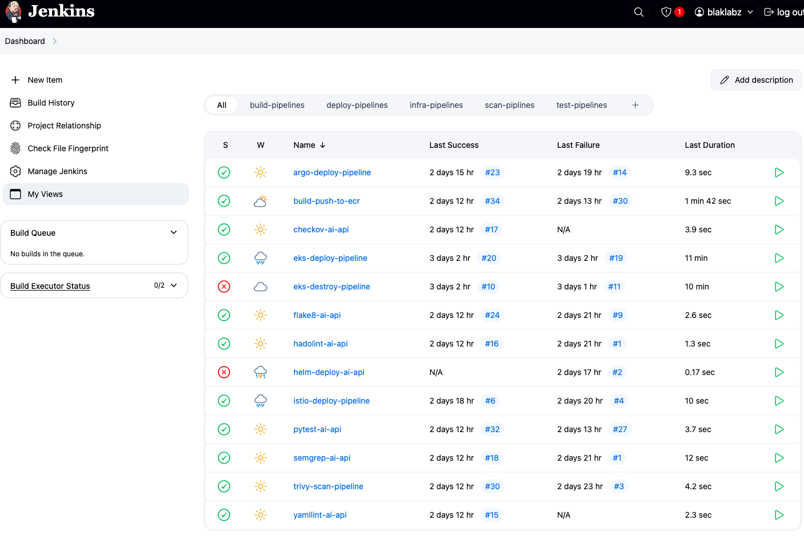
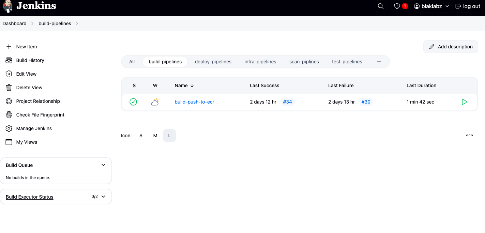
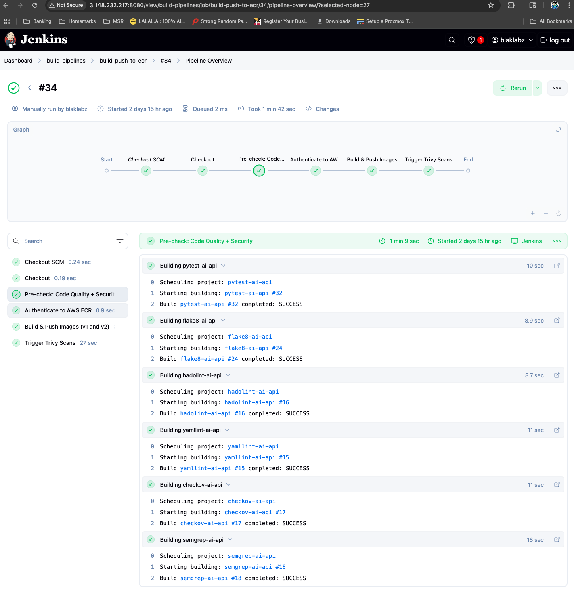
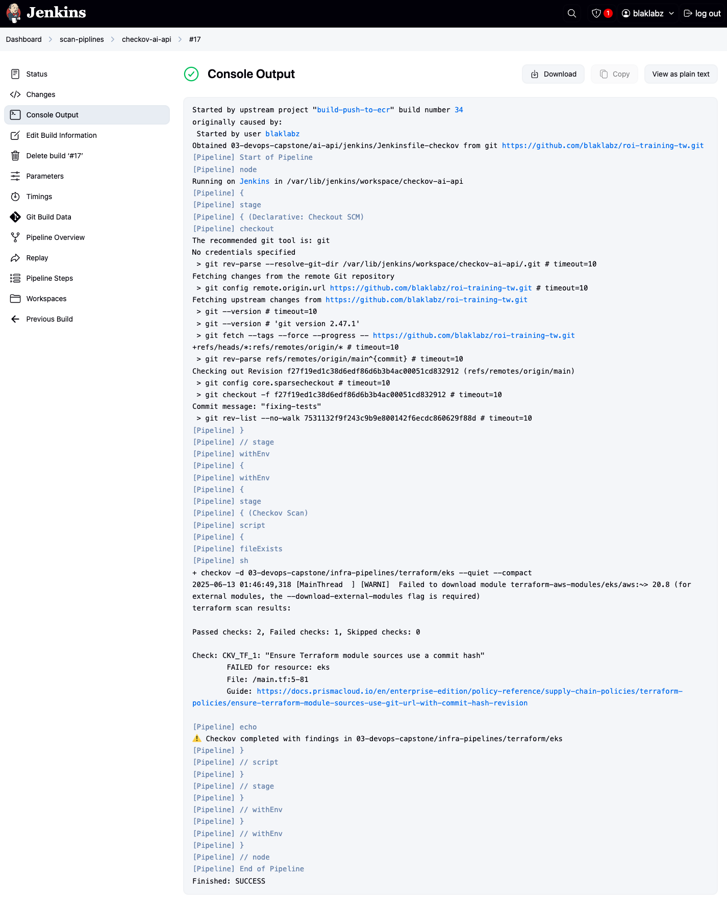
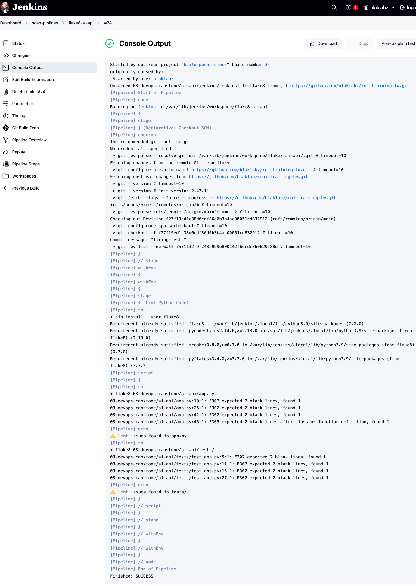
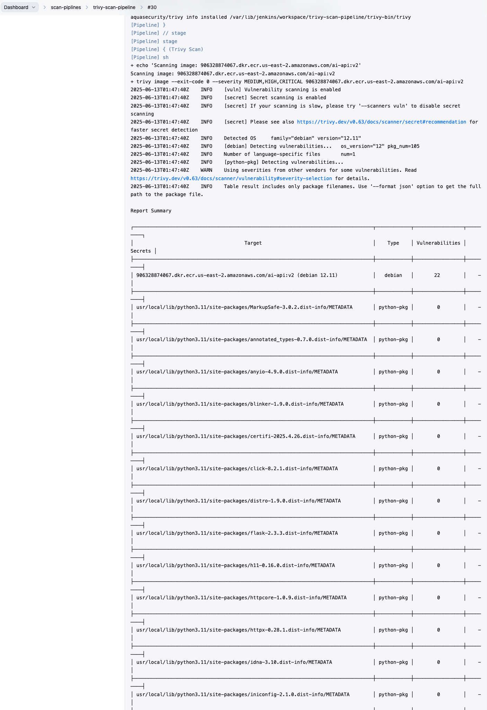
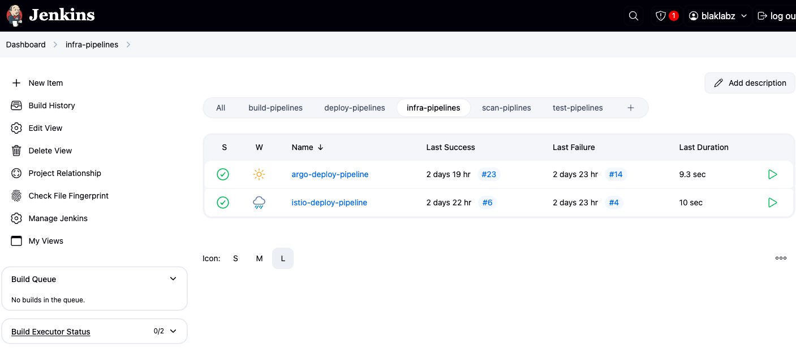
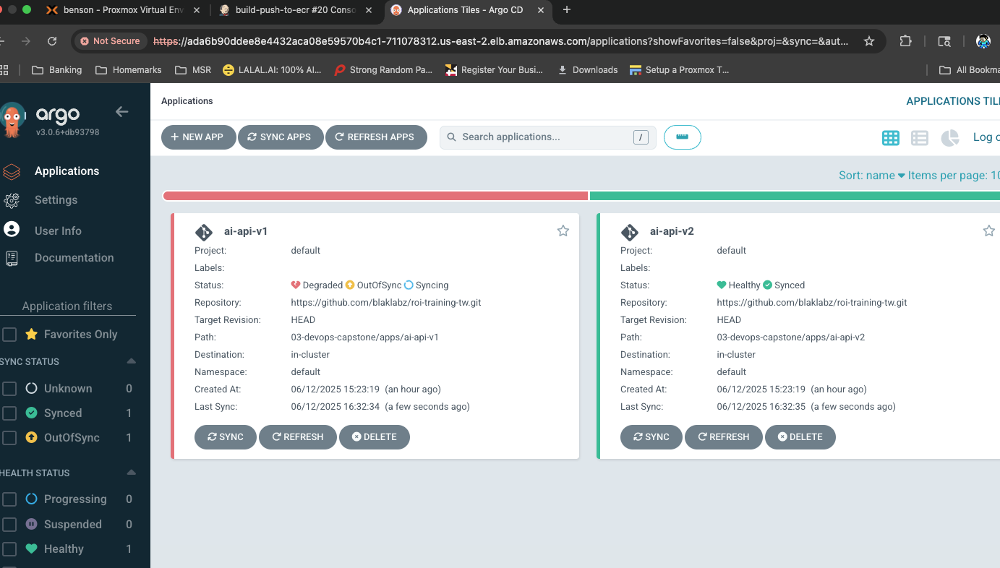

# AI API Chat Interface

This project is a lightweight Flask-based web application that lets users interact with OpenAI's GPT-4 via a web form or a REST API. It is containerized with Docker and deployed using Kubernetes and Istio, supporting blue/green deployments through versioned subsets.

Note: I was able to get this to work on my local python env but couldn't get it to work in eks - however, the jenkins pipelines should be working on the instance devops-tw.

---

<pre>
📁 Project Folder Structure

```
03-devops-capstone/
├── ai-api/                         # Main application code and related configs
│   ├── app.py                      # Flask API source code
│   ├── backend.tf                  # Terraform config for backend services
│   ├── Dockerfile                  # Container definition for ai-api
│   ├── helm/                       # Helm chart for ai-api deployment
│   │   └── ai-api/
│   │       ├── Chart.yaml          # Helm chart metadata
│   │       ├── values.yaml         # Default Helm values
│   │       ├── values-v1.yaml      # Helm values for version 1
│   │       ├── values-v2.yaml      # Helm values for version 2
│   │       ├── secrets/            # Kubernetes secrets templates
│   │        ├── .dockerconfigjson  # file for storing secret
│   │       └── templates/          # Helm templates (deployment, service, gateway, etc.)
│   │        ├── _helpers.tpl       # resuable naming/labels
│   │        ├── deployment.yaml    # defines the ai-api pods
│   │        ├── destinationrule.yaml # controls the loadbalancing (istio)
│   │        ├── gateway.yaml       # expose the istio service
│   │        ├── service.yaml       # creates the istio service
│   │        ├── virtualservice.yaml  # routing rules of the service v1/v2 (istio)
│
│   ├── images/                     # images for background
│   │
│   ├── jenkins/                    # Modular Jenkins pipelines for code quality and security
│   │   │
│   │   ├── Jenkinsfile-checkov    # Runs scans on Terraform code for misconfigurations and security
│   │   ├── Jenkinsfile-deploy     # Pipeline that will deploy the helm chart. (non-istio)
│   │   ├── Jenkinsfile-ecr        # Main job that builds and pushes the image for the app and initiates pipelines.
│   │   ├── Jenkinsfile-flake8     # Performs Python linting and style checks and tests.
│   │   ├── Jenkinsfile-hadolint   # Lints Dockerfile looking for best-practice violations and general issues.
│   │   ├── Jenkinsfile-pytest     # Runs unit tests for the ai-api server.
│   │   ├── Jenkinsfile-semgrep    # Static code analayzer, used to catch security and logic flaws in python.
│   │   ├── Jenkinsfile-trivy      # Peforms an image scan to detect vulnerabilities in the container image.
│   │   └── Jenkinsfile-yamllint   # Lints yaml files such as the Kubernetes manifests and Helm values.
│   │
│   ├── requirements.txt            # Python dependencies
│   ├── templates/                  # HTML templates for the app
│   └── tests/                      # App-level test code
│   │    ├── .flake8               # tests for flake8
│   │    ├── test_app.py           # tests for pytest
│
├── infra-pipelines/                # Infrastructure CI/CD and deployment logic
│   └── jenkins/                    # Infra-level Jenkins pipelines (ArgoCD, Istio)
│   │    ├── Jenkinsfile-argocd    # Jenkins pipeline to install argoCD to the eks cluster
│   │    ├── Jenkinsfile-istio     # Jenkins pipeline to install istio to the eks cluster
│
├── readme.md                       # This file - project overview, usage, and instructions
```
</pre>

---

## 🧠 Features

- Jenkins pipelines that run checks/scans/tests then builds and pushes the image to ecr, then scans the image.
- Flask web app with HTML form and OpenAI GPT-4 integration
- Kubernetes deployment with Helm and ArgoCD
- Istio Gateway and VirtualService support blue/green traffic split
- Secrets managed via Kubernetes for OpenAI API key

---

## 📦 Tech Stack

- **Python 3.11 + Flask**
- **OpenAI Python SDK**
- **Docker**
- **Kubernetes (EKS)**
- **Helm**
- **ArgoCD** - https://github.com/argoproj/argo-cd https://argoproj.github.io/cd/
- **Istio Ingress Gateway**

## 🔁 Pipeline Stack

- **Checkov** - Static analysis for Terraform/IaC https://www.checkov.io/
- **Flake8** – Python linter & style enforcer https://flake8.pycqa.org/
- **Hadolint** – Dockerfile best-practice linter https://github.com/hadolint/hadolint
- **Pytest** – Python testing framework
- **SemGrep** – Open‑source SAST (code analyzer) https://semgrep.dev/
- **Trivy** – Container image vulnerability scanner https://trivy.dev/
- **Yamllint**  – YAML syntax/style linter https://yamllint.readthedocs.io/

---

## 🚀 Deployment Overview

## Prerequisites
   * Have a Jenkins server up.
      - server needs AWS access
      - server has github access to https://github.com/blaklabz/roi-training-tw.git
   * Have a eks cluster deployed and available.
   * Have a ecr avaialabe to use
   * Have an OpenAI key (required for bot)

### Build and Push Image
  The whole project is maintained in git, when the code is updated two things happen. First, the user will build the image and push it to the ecr.  Along this build path, the code will go through checks and scans before being built, and then the image itself gets scanned.  Second, if ArgoCD is configured, it will detect the changes and automaticially update the pod structure on kubernetes to deploy the project.

 - This is a listing of all the pipelines used for this project
 

 - Use the pipeline 'build-push-to-ecr' to build the docker image and initiate the gitOps pipeline.
 

 - The build process will walk through the checks/scans
 
 note: jobs were created to pass even if problems were found

 - This is an example of checkov failing the check
 

 - This is an example of flake8 failing the check
 

- This is an example of trivy scan results
 


### 2. Set Secrets
 - kubectl create secret generic openai-api-key \
   --from-literal=OPENAI_API_KEY=sk-xxxxxxxxxxxxxxxxxxxx \
   --namespace=default

### 3. Deploy Istio and ArgoCD
 - use the jenkins jobs to deploy Istio to the cluster
  
 - use the jenkins job to deploy ArgoCD to the cluster

### 4. Manage deployments with ArgoCD
 - access the argoCD UI from inside the cluster.
    - the
- This is an example of trivy scan results
 
